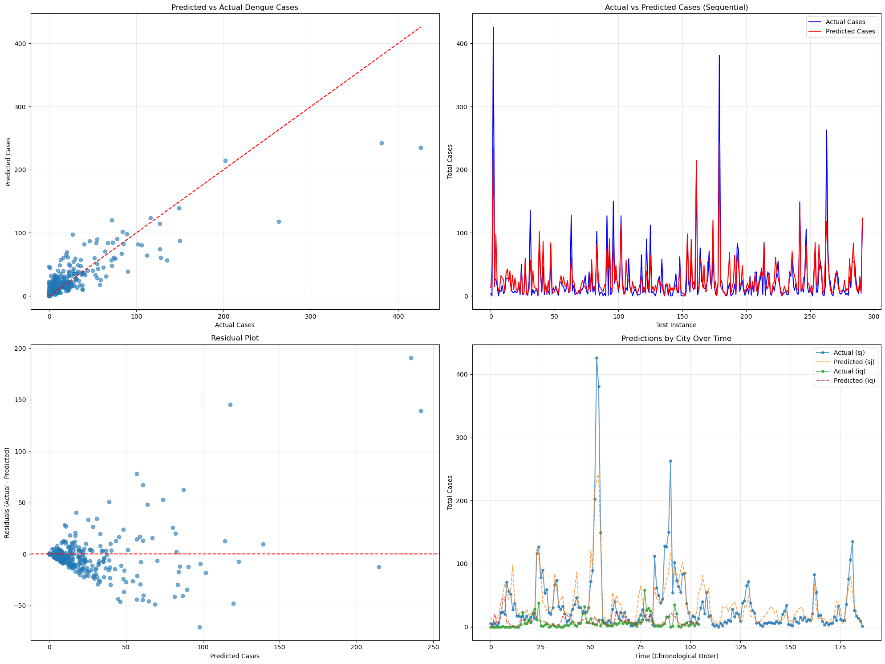

# DengueAI Prediction Challenge

## Project Overview
This project presents a machine learning solution for the DengueAI competition hosted by DrivenData, predicting dengue fever cases in San Juan, Puerto Rico and Iquitos, Peru using environmental and climate data.

## The Challenge
Dengue fever is a mosquito-borne disease affecting millions globally each year. The competition tasks participants with predicting weekly dengue cases based on environmental variables including temperature, precipitation, vegetation indices, and humidity.

## Solution Approach
### Data Preprocessing Pipeline
The solution implements a custom scikit-learn compatible preprocessing pipeline:

- Feature Selection: Retained relevant environmental features and location identifiers
- Time-Series Processing: Created 3-week rolling averages for key climate variables
- Missing Value Handling: Implemented city-specific imputation for missing data
- Data Normalization: Applied standard scaling to all features

### Custom Transformers
The project includes several custom transformers to handle specific preprocessing needs:

- DropColumnsTransformer: Removes specified columns
- CityMapTransformer: Encodes city names as numerical values
- CityBasedImputer: Imputes missing values using city-specific statistics
- RollingAverageTransformer: Creates temporal features with rolling windows

## Model Architecture
- Algorithm: Random Forest Regressor with 150 estimators
- Training Strategy: 80% of data used for training, 20% for validation
- Full Data Utilization: Final model retrained on complete dataset before competition submission

## Evaluation & Visualizations
The project includes comprehensive model evaluation:

- Actual vs. predicted case comparison
- Time-series analysis of prediction accuracy
- Residual analysis
- City-specific performance tracking
- Spike detection evaluation

## Implementation Details
### Feature Engineering
Key features used in the model include:

- Climate measurements (temperatures, humidity)
- Precipitation data
- Vegetation indices
- Temporal information (year, week)

### Pipeline Architecture

```python
pipeline = Pipeline(steps=[
    ('drop_columns', DropColumnsTransformer()),
    ('city_encoder', CityMapTransformer()),
    ('imputer', CityBasedImputer(city_column='city')),
    ('rolling_avg', RollingAverageTransformer(window=3)),
    ('drop_rolling_columns', DropColumnsTransformer()),
    ('scaler', StandardScaler()),
    ('model', RandomForestRegressor())
])
```

## Model Performance
The graph above illustrates our model's internal validation performance when tested on a held-out portion of the training dataset. The visualization compares actual reported cases (blue line) against our model's predictions (orange line) throughout the validation period.



## Performance Metrics
While this graph represents our internal validation results, our final model achieved a Mean Absolute Error (MAE) score of 25.48 on the external competition test set. This external evaluation score reflects the model's true predictive performance on unseen data as evaluated by the DengueAI competition platform.

Key observations from the validation graph:
- The internal validation helped identify how well our model captures the seasonal trends in both San Juan and Iquitos
- The visualization guided our feature engineering and hyperparameter tuning process
- Areas where predictions deviate from actual values informed our iterative model improvements
- This validation analysis was crucial in developing the final model that achieved the 25.48 MAE on the competition dataset
- The external MAE score of 25.48 represents our official performance metric for the DengueAI challenge, demonstrating the effectiveness of our approach when applied to new, unseen dengue case data.

## Key Findings
- Time-series features significantly improve prediction accuracy
- City-specific patterns require specialized preprocessing
- Full pipeline approach outperforms separated components
- Model struggles most with predicting large case spikes

## Future Work
- Experiment with different window sizes for rolling averages
- Explore more sophisticated time-series models (LSTM, Prophet)
- Incorporate additional environmental and demographic features
- Implement ensemble approaches combining multiple model types
